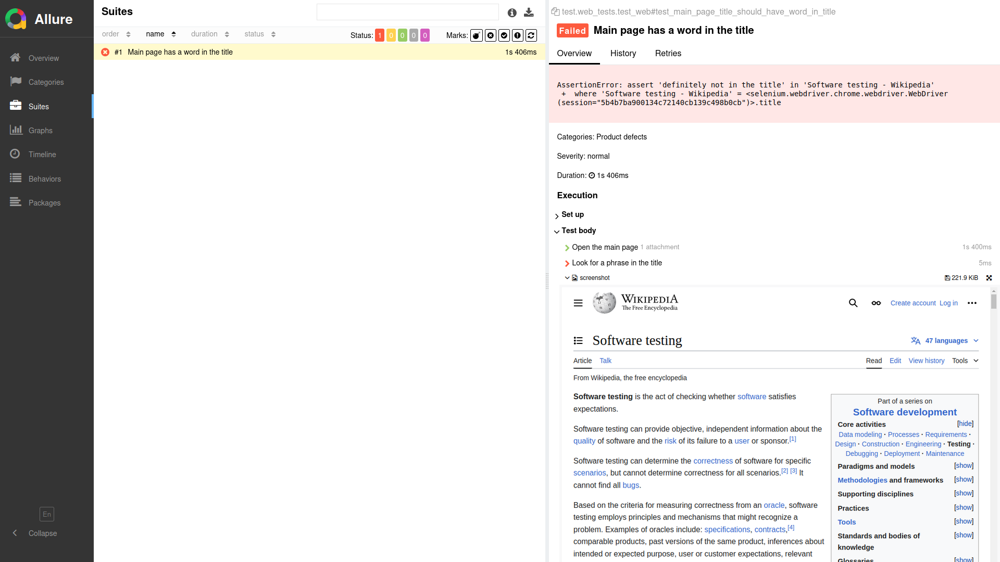

# QA Automation Pet Project (Junior)

[](https://github.com/ivanbogomolov246-lang/qa-automation-pet-project/actions/workflows/tests.yml)


Pet project for a QA Automation Engineer (Junior/Junior+) resume.

## What Is Inside

- API tests (`requests + pytest`)
- UI tests (`Playwright + pytest`)
- Simplified Page Object Model
- Basic fixtures and config
- Allure reporting support
- API CI run with GitHub Actions

## Tech Stack

- Python
- Pytest
- Requests
- Playwright
- Allure Pytest
- python-dotenv

## Project Structure

```text
project/
|-- api/
|-- config/
|-- pages/
|-- tests/
|   |-- api/
|   `-- ui/
|-- utils/
|-- .github/workflows/
|-- conftest.py
|-- pytest.ini
|-- requirements.txt
`-- README.md
```

## Test Coverage

### API (`jsonplaceholder.typicode.com`)
- GET by id
- GET with query params
- POST create resource
- Status code assertions
- Response body assertions
- Negative scenarios (404, empty result)

### UI (`saucedemo.com`)
- Successful login
- Invalid login
- Add item to cart
- Cart content validation
- Logout

## Test Environments

- API base endpoint: [https://jsonplaceholder.typicode.com](https://jsonplaceholder.typicode.com)
- UI test site: [https://www.saucedemo.com](https://www.saucedemo.com)

## What I Practiced

- Building API tests with `requests`
- Structuring tests with pytest fixtures
- Applying Page Object Model for UI tests
- Separating configuration from test logic
- Generating Allure reports
- Running API tests in CI with GitHub Actions

## Quick Start

1. Create virtual environment:

```bash
python -m venv .venv
```

2. Activate it:

```bash
# Windows (PowerShell)
.venv\Scripts\Activate.ps1
```

3. Install dependencies:

```bash
pip install -r requirements.txt
playwright install chromium
```

4. Create `.env` from template:

```bash
copy .env.example .env
```

## Run Tests

Run all tests:

```bash
pytest
```

Run only API:

```bash
pytest -m api
```

Run only UI:

```bash
pytest -m ui
```

Run UI in headed mode:

```bash
pytest -m ui --headed
```

## CI (GitHub Actions)

Workflow file:

```text
.github/workflows/tests.yml
```

It runs API tests on each push and pull request to `main`.

## Allure Reports

Generate results:

```bash
pytest --alluredir=allure-results
```

Open report:

```bash
allure serve allure-results
```

Example Allure report screenshot:



## Why This Is Junior-Friendly

- Simple and clear structure
- No overengineering
- Every part is easy to explain in an interview:
  - `api/` for API calls
  - `pages/` for UI page logic
  - `tests/` for test scenarios
  - `conftest.py` for fixtures and setup
